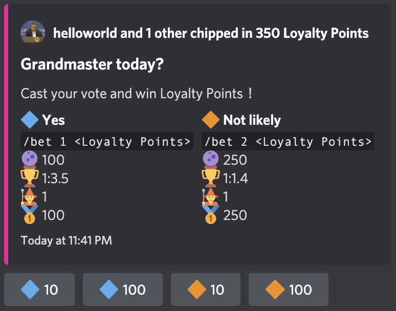

# Predictions

`Burn hill good thing, thank you burn hill`


A discord.js bot that provides Twitch Predictions-like experience in Discord guilds, allowing users to gamble on game (or whatever) outcomes and win (useless) game points.


### Bot in action




### Setup

#### Setup with Docker

1. Set Discord Bot token, client ID, and development guild ID in `config.json`.

2. Register application commands to Discord API. In the project directory, run:

   ```bash
   # Requires Node.js 16.6.0+
   npm install
   npm run regprod
   ```

3. With docker and docker-compose installed, in the project directory, run:

   ```bash
   docker-compose up -d
   ```

#### Setup manually

1. Start a redis container

   ```bash
   docker run --restart unless-stopped -p 6379:6379 --name pred-redis -d redis redis-server --appendonly yes
   ```

   ~~See you will need docker anyways just setup with docker~~


### Bot usage

Usage of bot in explained in the `/help` command:

